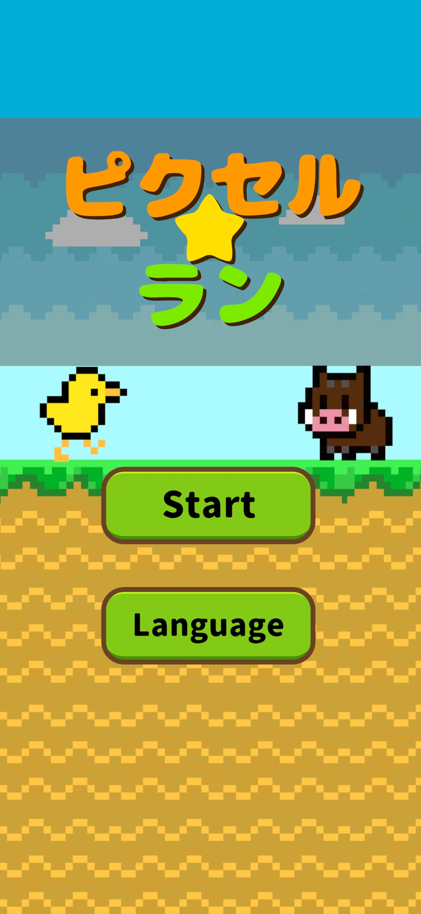
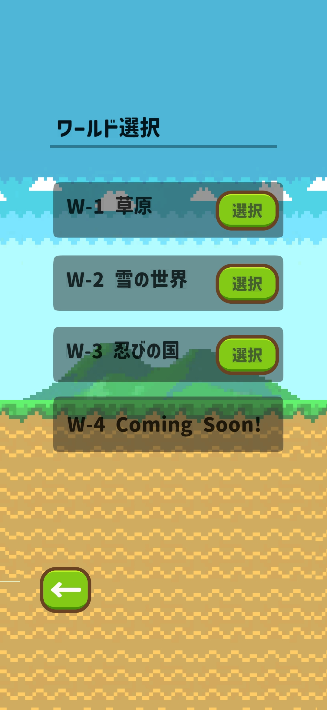
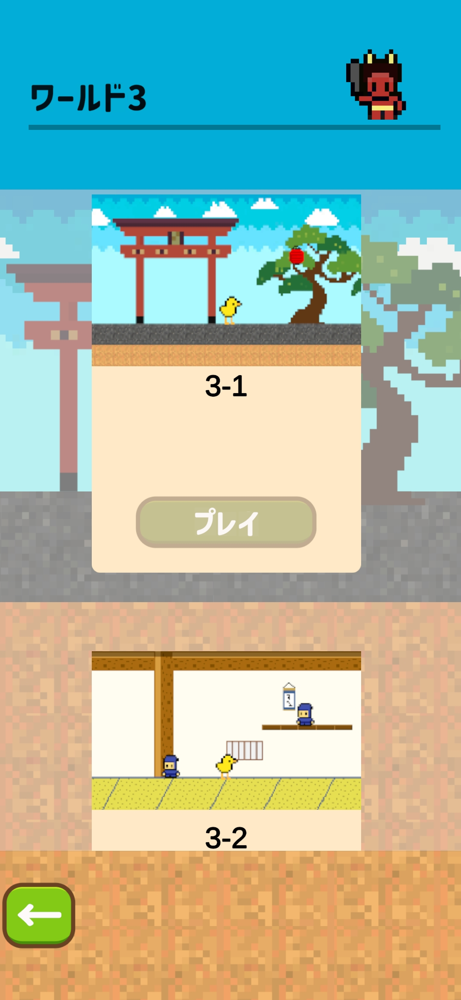
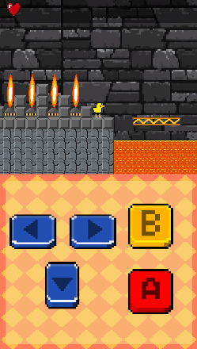
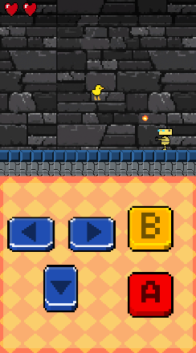
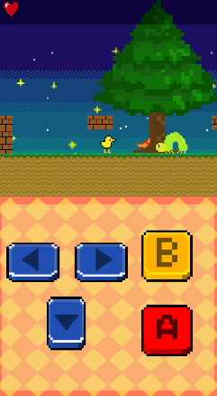
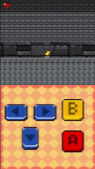
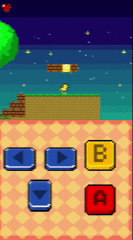

# 2Dランゲーム

> スーパーマリオのような2DランゲームAndroidアプリ

## Demo / Visuals (デモ・プレイ動画)

  
  
  
  
  
  
  
  

## Overview

「スーパーマリオ」のようなクラシックな2Dアクションゲームの操作感にインスパイアされ、Unityでゼロから開発した横スクロールアクションゲームです。
単なるジャンプアクションにとどまらず、手元に戻ってくる「ブーメラン」による遠距離攻撃や、HP・無敵時間を持つボス戦など、プレイヤーを飽きさせない拡張要素を実装しています。

## Motivation

ゲームの表層的な面白さだけでなく、裏側で動く「状態管理（State Management）」や「コンポーネント指向の設計」を深く理解するために開発しました。
敵を踏んだ際の物理的な反発ロジックや、PlayerPrefsを用いたステージの進行データの永続化など、実務的なアプリケーション開発にも通じるデータ制御の基礎を、ゲームという具体的なプロダクトを通して実践しています。

## Tech Stack

* **Engine:** Unity 
* **Language:** C#
* **Input:** Unity Input System / EventSystems (テスト時のPCキーボード操作およびモバイルタッチ操作の両対応)
* **Data Persistence:** PlayerPrefs (ステージの解放状況のセーブ・ロード)

## Key Features & Technical Highlights

### 1. 物理演算を利用した「踏みつけ」と「反発」ロジック
* `Rigidbody2D` の `velocity.y` を監視し、「プレイヤーが落下中（y < 0）にのみ」敵の頭上コライダーと接触した場合にダメージを与えるロジックを実装。単なる接触判定ではなく、物理的な状態（落下ベクトル）を条件に組み込むことで、直感的でバグのないアクションを実現しました。

### 2. クールダウンと状態遷移を持つブーメランシステム
* プレイヤーの攻撃手段としてブーメランを実装。コルーチン（`IEnumerator`）を用いて「投げている間は再使用不可」「一定時間で手元に戻る（再使用可能になる）」という非同期的なクールダウン処理を実装し、攻撃のスパム（連打）を防ぐゲームバランスを構築しています。

### 3. ステージ解放システムとセーブデータ管理
* `StageClearManager` と `PlayerPrefs` を連携させ、「クリアしたステージ数＋1」をアンロック変数として保存。UI側（`StageButton`）でこの変数を読み込み、未解放ステージのボタンを非アクティブにしつつ鍵アイコンを表示する、堅牢な進行管理システムを構築しました。

## Installation & Usage

### プレイ方法
1. 本リポジトリの [Releases](リリースページのURL) から `.apk` ファイル（Android用）をダウンロードしてください。
2. Android端末にインストールするとすぐにプレイ可能です。
